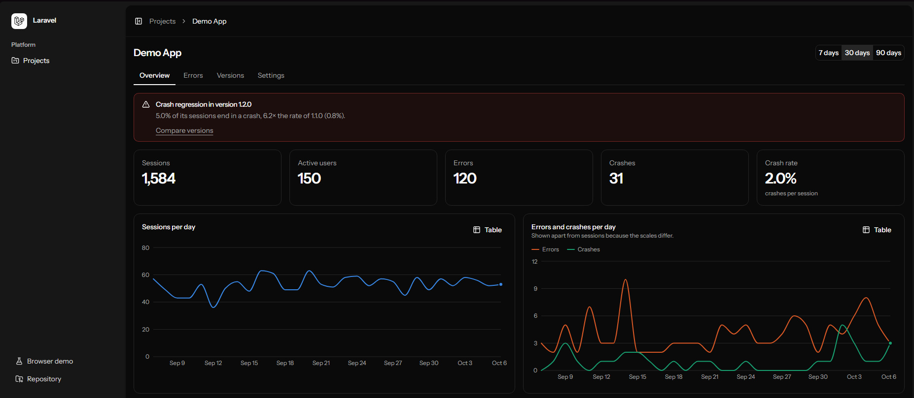
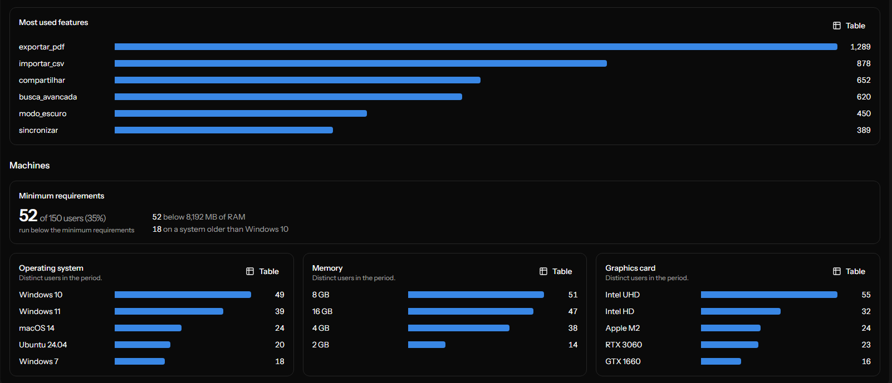
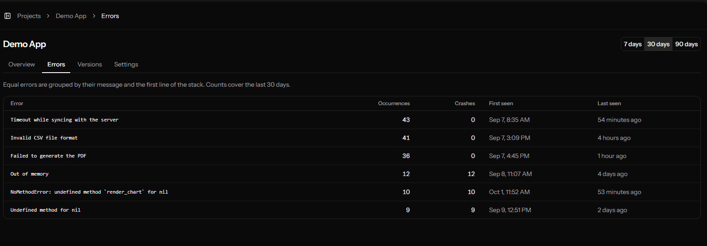
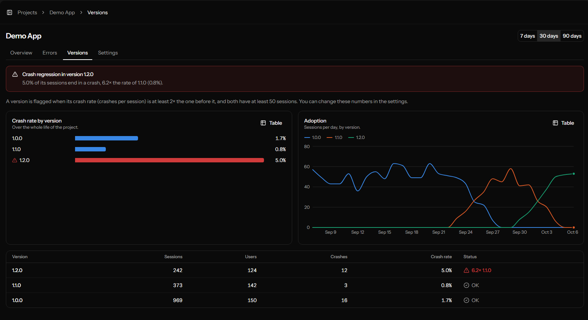
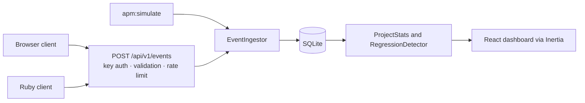

# mini-apm

[](https://github.com/gabpese/mini-apm-laravel/actions/workflows/tests.yml)
[](LICENSE)


**Read this in:** English · [Português](README.pt-BR.md)

A small, open source application performance monitor. Your apps send usage, error and crash events to a REST API, and a dashboard shows what is happening, including which **version** started crashing more than the one before it.



> Inspired by real-world experience collecting usage, error and crash data from desktop software. Everything here was written from scratch, around an invented application.

## What it does

- **Receives events** at `POST /api/v1/events`: sessions, feature usage, errors and crashes, in batches, authenticated by a per-project API key.
- **Groups errors** that are the same, by message and the first line of the stack, and counts them.
- **Shows adoption and stability per version**: sessions, users, crash rate and how fast each release spreads.
- **Flags crash regressions.** When the newest version's crash rate reaches a multiple of the previous one's, the dashboard says so. See [how the alert works](#how-the-regression-alert-works).
- **Describes the machines** running your app (operating system, memory, graphics card) and counts who is below your minimum requirements.
- **Fills itself with demo data**: `php artisan apm:simulate` creates weeks of realistic fictional usage, with a regression on purpose, so the dashboard is never empty.





## Quick start

You need PHP 8.4, Composer and Node 22. [Laravel Herd](https://herd.laravel.com) installs the first two on Windows and macOS.

```bash
git clone https://github.com/gabpese/mini-apm-laravel.git && cd mini-apm-laravel
composer setup               # installs, builds, migrates and creates the demo account
php artisan apm:simulate     # fills a demo project with fictional data
composer dev                 # opens http://localhost:8000
```

Sign in with `demo@example.com` / `password` (set in `.env`, see `DEMO_USER_*`). Open **Demo App** to see the dashboard.

## Sending events

Every project has API keys, created in the project's **Settings**. A key is shown once, because only a hash of it is stored.

```bash
curl -X POST http://localhost:8000/api/v1/events \
  -H "Authorization: Bearer apm_your_key" \
  -H "Content-Type: application/json" \
  -d '{"events":[
        {"type":"session_start","occurred_at":"2026-10-20T14:03:00Z","app_version":"1.2.0","user_ref":"u_8f3a",
         "env":{"os":"Windows 11","ram_mb":16384,"gpu":"GTX 1660"}},
        {"type":"feature_used","name":"export_pdf","occurred_at":"2026-10-20T14:05:12Z","app_version":"1.2.0","user_ref":"u_8f3a"},
        {"type":"crash","message":"Undefined method for nil","stack":"app.rb:10:in `run`","occurred_at":"2026-10-20T14:07:40Z","app_version":"1.2.0","user_ref":"u_8f3a"}
      ]}'
```

| Type            | Needs                                   | Meaning                                                               |
| --------------- | --------------------------------------- | --------------------------------------------------------------------- |
| `session_start` | `env` (optional: `os`, `ram_mb`, `gpu`) | A user opened the app. Counts as a session and describes the machine. |
| `feature_used`  | `name`                                  | A feature was used.                                                   |
| `error`         | `message`, optionally `stack`           | A handled error.                                                      |
| `crash`         | `message`, optionally `stack`           | The app crashed. Feeds the crash rate.                                |

All events need `occurred_at` (ISO 8601) and `app_version`, and may carry a `user_ref`, an anonymous user id. Events are linked to the latest session of the same `user_ref` and version.

|                |                                                                                              |
| -------------- | -------------------------------------------------------------------------------------------- |
| **Auth**       | `Authorization: Bearer <key>` or `X-API-Key: <key>`                                          |
| **Batch size** | 1 to 100 events. If one is invalid, nothing from the batch is stored (`422`).                |
| **Rate limit** | 120 requests a minute per key and 600 per IP address (`429`). Invalid keys count too.        |
| **Answers**    | `202 {"accepted": n}`, `401` bad or revoked key, `422` invalid data, `429` too many requests |
| **CORS**       | Open, so a browser app can send events directly                                              |

### Clients

Both are in [`clients/`](clients), have no dependencies, batch events, retry when the server is down, and never queue more than 500 events.

**Browser** ([`clients/js`](clients/js/mini-apm.js)): also captures `window.onerror` and unhandled promise rejections.

```js
import { MiniApm } from './mini-apm.js';

const apm = new MiniApm({
    endpoint: 'http://localhost:8000',
    apiKey: 'apm_...',
    appVersion: '1.2.0',
});
apm.start(); // opens a session
apm.track('export_pdf'); // a feature was used
apm.captureException(error, { fatal: true }); // a crash. Without `fatal`, an error.
```

Run the server and open `/demo` for a page whose buttons send real events from your browser.

**Ruby** ([`clients/ruby`](clients/ruby/lib/mini_apm.rb)): standard library only.

```ruby
apm = MiniApm::Client.new(endpoint: 'http://localhost:8000', api_key: 'apm_...', app_version: '1.2.0')
apm.session_start
apm.track('export_pdf')
begin
  risky
rescue => e
  apm.capture_exception(e)
end
apm.flush
```

`ruby clients/ruby/demo_app.rb --key apm_... --url http://localhost:8000` runs a fake desktop app in the terminal that opens sessions, uses features and sometimes fails.

## How the regression alert works



Crash rate is `crashes ÷ sessions` of a version. A version is flagged when:

- its rate is at least **2×** the previous version's, and
- **both** versions have at least **50 sessions**, so a few sessions cannot raise a false alarm.

Both numbers can be changed per project in **Settings**. If the previous version had no crashes at all the ratio is infinite, so the newest version is flagged only when it has at least 3 crashes. Versions are ordered as versions (`1.9.0` before `1.10.0`), not as text.

The alert banner is about the **newest** version, since it is what users run today. Older flagged versions stay marked in the versions table as history.

## How it is built



One Laravel application serves both the API and the dashboard, so there is no separate front-end project.

| Layer     | Choice                                                                                  |
| --------- | --------------------------------------------------------------------------------------- |
| Back end  | Laravel 13, PHP 8.4                                                                     |
| Front end | React 19, TypeScript, Inertia 3                                                         |
| Interface | Tailwind 4, shadcn/ui, Recharts                                                         |
| Database  | SQLite. Queries use only plain aggregates, but MySQL has not been tried.                |
| Tests     | Pest (PHP), the Node test runner (browser client), Minitest (Ruby client)               |
| Quality   | Laravel Pint, PHPStan (Larastan), and linting and formatting through Vite+ (`vp check`) |
| CI        | GitHub Actions: lint, types, all three test suites                                      |

### Data model

| Table          | Holds                                                                   |
| -------------- | ----------------------------------------------------------------------- |
| `projects`     | One per monitored app: owner, minimum RAM and OS, alert thresholds      |
| `api_keys`     | A hash of each key, never the key. Keys are revoked, not deleted.       |
| `app_sessions` | One per use of the app: version, OS, memory, graphics card              |
| `events`       | Feature use, errors and crashes, linked to a session and an error group |
| `error_groups` | Equal errors counted together by their fingerprint                      |

### Decisions worth knowing

- **Keys are hashed.** The text of an API key exists once, when you create it. Like a password, it cannot be shown again.
- **Other people's projects answer 404, not 403**, so nobody can tell which project ids exist.
- **A bad event rejects the whole batch.** Partial writes would make retries create duplicates.
- **The simulator uses the same ingestion code as the API**, so demo data is proof that the real path works.
- **The dashboard computes everything with aggregate queries**, so a page costs the same with ten events or ten million.

## Same API, two implementations

This project also exists in Ruby on Rails: [mini-apm-rails](https://github.com/gabpese/mini-apm-rails). It is the same product built twice, to compare how each framework solves the same problem. Both accept the same batches and answer the same status codes.

The batch format is written down once, in [`events.schema.json`](events.schema.json), a JSON Schema. The same file lives in both repositories, and [`EventSchemaTest`](tests/Feature/Api/EventSchemaTest.php) runs the same list of valid and invalid batches against the schema and against this API: both must give the same verdict. The Rails repository runs the same cases.

| Piece                  | Laravel (this repository)    | Rails                                            |
| ---------------------- | ---------------------------- | ------------------------------------------------ |
| Database access        | Eloquent                     | Active Record                                    |
| Migrations             | `php artisan make:migration` | `bin/rails generate migration`                   |
| Validating a batch     | Form Request                 | `events.schema.json` checked with `json_schemer` |
| Validating a project   | Form Request                 | Model validations and strong parameters          |
| API key authentication | Middleware                   | `before_action` in the controller                |
| Rate limiting          | `RateLimiter`                | `rate_limit` in the controller                   |
| Login                  | Fortify                      | Authentication Zero (from the starter kit)       |
| Demo data              | `php artisan apm:simulate`   | `bin/rails apm:simulate` (Rake task)             |
| Crash regression rule  | Service class                | Plain Ruby class in `app/services`               |
| Authorization          | Policy                       | Scoping through `Current.user.projects`          |
| Tests                  | Pest                         | RSpec and FactoryBot                             |
| Code style             | Pint                         | RuboCop                                          |
| Database               | SQLite                       | PostgreSQL                                       |

Small differences: this API accepts any date its parser understands in `occurred_at`, where the Rails one requires ISO 8601; the text of validation messages differs; and the demo data has the same shape and regression, but not the same numbers.

## Development

```bash
composer ci:check        # formatting, lint, types, PHPStan and the Pest suite
npm run test:clients     # browser client (Node) and Ruby client tests
```

`composer ci:check` and `npm run test:clients` are what the [CI workflow](.github/workflows/tests.yml) runs.

## Deploy

The [`Dockerfile`](Dockerfile) builds the assets and serves the app with [FrankenPHP](https://frankenphp.dev). [`render.yaml`](render.yaml) describes a free [Render](https://render.com) web service: **New > Blueprint**, pick this repository.

To try the image locally:

```bash
docker build -t mini-apm .
docker run --rm -p 8080:8080 \
  -e DEMO_SEED=true -e DEMO_USER_EMAIL=demo@example.com -e DEMO_USER_PASSWORD=change-me \
  mini-apm
```

| Variable                                | Purpose                                                                              |
| --------------------------------------- | ------------------------------------------------------------------------------------ |
| `DEMO_SEED`                             | `true` creates the demo account and fills the demo project on every start            |
| `DEMO_USER_EMAIL`, `DEMO_USER_PASSWORD` | The demo account                                                                     |
| `DEMO_API_KEY`                          | A fixed public key. With it, `/demo` opens ready to send events to the demo project. |
| `TRUSTED_PROXIES`                       | Set to `*` behind a load balancer that ends HTTPS, so links stay `https`             |
| `APP_KEY`, `APP_URL`                    | Made up at start (or taken from Render) when not set                                 |

On the free Render plan the app sleeps after 15 minutes without visits, and its disk is temporary: SQLite starts empty on every start, and the demo data is created again. Do not use a demo setup for real data. [Laravel Cloud](https://laravel.com/cloud) is a good option when you want a database that lasts.

## Roadmap

Left out of v1 on purpose:

- email and Slack alerts for regressions
- processing events in a queue
- teams with several users and permissions
- automatic cleanup of old events
- a public status page that reads the API

## License

[MIT](LICENSE)
