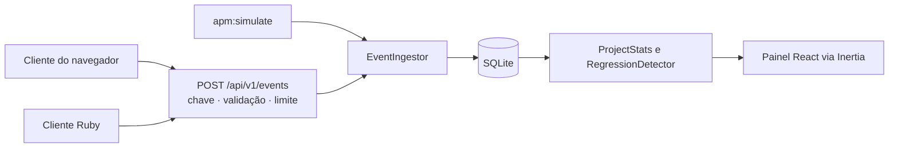

# mini-apm

[](https://github.com/gabpese/mini-apm-laravel/actions/workflows/tests.yml)
[](LICENSE)


**Leia em:** [English](README.md) · Português

Um monitor de desempenho de aplicações pequeno e de código aberto. Seus apps enviam eventos de uso, erros e crashes para uma API REST, e um painel mostra o que está acontecendo, inclusive qual **versão** passou a ter mais crashes que a anterior.


> Inspirado na experiência real de coletar dados de uso, erros e crashes de software desktop. Tudo aqui foi escrito do zero, em torno de uma aplicação inventada.

## O que faz

- **Recebe eventos** em `POST /api/v1/events`: sessões, uso de funcionalidades, erros e crashes, em lotes, autenticados por uma chave de API de cada projeto.
- **Agrupa erros** iguais, pela mensagem e pela primeira linha da pilha de chamadas, e conta as ocorrências.
- **Mostra adoção e estabilidade por versão**: sessões, usuários, taxa de crash e a velocidade com que cada versão se espalha.
- **Sinaliza regressões de crash.** Quando a taxa de crash da versão mais nova chega a um múltiplo da anterior, o painel avisa. Veja [como o alerta funciona](#como-o-alerta-de-regressão-funciona).
- **Descreve as máquinas** que rodam seu app (sistema operacional, memória, placa de vídeo) e conta quem está abaixo dos seus requisitos mínimos.
- **Se enche sozinho com dados de demonstração**: `php artisan apm:simulate` cria semanas de uso fictício e realista, com uma regressão proposital, para o painel nunca ficar vazio.


## Começando

Você precisa de PHP 8.4, Composer e Node 22. O [Laravel Herd](https://herd.laravel.com) instala os dois primeiros no Windows e no macOS.

```bash
git clone https://github.com/gabpese/mini-apm-laravel.git && cd mini-apm-laravel
composer setup               # instala, compila, migra e cria a conta de demonstração
php artisan apm:simulate     # enche um projeto de demonstração com dados fictícios
composer dev                 # abre http://localhost:8000
```

Entre com `demo@example.com` / `password` (definidos no `.env`, veja `DEMO_USER_*`). Abra o **Demo App** para ver o painel.

## Enviando eventos

Cada projeto tem chaves de API, criadas em **Settings** do projeto. A chave aparece uma única vez, porque só um hash dela é guardado.

```bash
curl -X POST http://localhost:8000/api/v1/events \
  -H "Authorization: Bearer apm_sua_chave" \
  -H "Content-Type: application/json" \
  -d '{"events":[
        {"type":"session_start","occurred_at":"2026-10-20T14:03:00Z","app_version":"1.2.0","user_ref":"u_8f3a",
         "env":{"os":"Windows 11","ram_mb":16384,"gpu":"GTX 1660"}},
        {"type":"feature_used","name":"export_pdf","occurred_at":"2026-10-20T14:05:12Z","app_version":"1.2.0","user_ref":"u_8f3a"},
        {"type":"crash","message":"Undefined method for nil","stack":"app.rb:10:in `run`","occurred_at":"2026-10-20T14:07:40Z","app_version":"1.2.0","user_ref":"u_8f3a"}
      ]}'
```

| Tipo            | Precisa de                              | Significado                                                     |
| --------------- | --------------------------------------- | --------------------------------------------------------------- |
| `session_start` | `env` (opcional: `os`, `ram_mb`, `gpu`) | Um usuário abriu o app. Conta como sessão e descreve a máquina. |
| `feature_used`  | `name`                                  | Uma funcionalidade foi usada.                                   |
| `error`         | `message`, e opcionalmente `stack`      | Um erro tratado.                                                |
| `crash`         | `message`, e opcionalmente `stack`      | O app travou. Alimenta a taxa de crash.                         |

Todo evento precisa de `occurred_at` (ISO 8601) e `app_version`, e pode ter um `user_ref`, um id anônimo de usuário. Os eventos são ligados à sessão mais recente do mesmo `user_ref` e da mesma versão.

|                           |                                                                                                          |
| ------------------------- | -------------------------------------------------------------------------------------------------------- |
| **Autenticação**          | `Authorization: Bearer <chave>` ou `X-API-Key: <chave>`                                                  |
| **Tamanho do lote**       | De 1 a 100 eventos. Se um for inválido, nada do lote é gravado (`422`).                                  |
| **Limite de requisições** | 120 por minuto por chave e 600 por endereço IP (`429`). Chaves inválidas também contam.                  |
| **Respostas**             | `202 {"accepted": n}`, `401` chave inválida ou revogada, `422` dados inválidos, `429` requisições demais |
| **CORS**                  | Aberto, para um app no navegador poder enviar eventos direto                                             |

### Clientes

Os dois ficam em [`clients/`](clients), não têm dependências, enviam em lotes, tentam de novo quando o servidor está fora do ar e nunca guardam mais de 500 eventos na fila.

**Navegador** ([`clients/js`](clients/js/mini-apm.js)): também captura `window.onerror` e promessas rejeitadas sem tratamento.

```js
import { MiniApm } from './mini-apm.js';

const apm = new MiniApm({
    endpoint: 'http://localhost:8000',
    apiKey: 'apm_...',
    appVersion: '1.2.0',
});
apm.start(); // abre uma sessão
apm.track('export_pdf'); // uma funcionalidade foi usada
apm.captureException(error, { fatal: true }); // um crash. Sem `fatal`, um erro.
```

Com o servidor rodando, abra `/demo`: uma página cujos botões enviam eventos reais do seu navegador.

**Ruby** ([`clients/ruby`](clients/ruby/lib/mini_apm.rb)): só a biblioteca padrão.

```ruby
apm = MiniApm::Client.new(endpoint: 'http://localhost:8000', api_key: 'apm_...', app_version: '1.2.0')
apm.session_start
apm.track('export_pdf')
begin
  risky
rescue => e
  apm.capture_exception(e)
end
apm.flush
```

`ruby clients/ruby/demo_app.rb --key apm_... --url http://localhost:8000` roda no terminal um app desktop de mentira que abre sessões, usa funcionalidades e às vezes falha.

## Como o alerta de regressão funciona


A taxa de crash é `crashes ÷ sessões` de uma versão. Uma versão é sinalizada quando:

- sua taxa é de pelo menos **2×** a da versão anterior, e
- **as duas** versões têm pelo menos **50 sessões**, para que poucas sessões não gerem um falso alarme.

Os dois números podem ser mudados por projeto em **Settings**. Se a versão anterior não teve nenhum crash, a razão é infinita, então a versão mais nova só é sinalizada quando tem pelo menos 3 crashes. As versões são ordenadas como versões (`1.9.0` antes de `1.10.0`), não como texto.

O banner de alerta trata da versão **mais nova**, que é o que os usuários rodam hoje. Versões antigas sinalizadas continuam marcadas na tabela de versões, como histórico.

## Como é construído



Uma única aplicação Laravel serve a API e o painel, então não há um projeto de front-end separado.

| Camada    | Escolha                                                                                  |
| --------- | ---------------------------------------------------------------------------------------- |
| Back-end  | Laravel 13, PHP 8.4                                                                      |
| Front-end | React 19, TypeScript, Inertia 3                                                          |
| Interface | Tailwind 4, shadcn/ui, Recharts                                                          |
| Banco     | SQLite. As consultas usam só agregações simples, mas o MySQL não foi testado.            |
| Testes    | Pest (PHP), o executor de testes do Node (cliente do navegador), Minitest (cliente Ruby) |
| Qualidade | Laravel Pint, PHPStan (Larastan), e lint e formatação pelo Vite+ (`vp check`)            |
| CI        | GitHub Actions: lint, tipos e as três suítes de testes                                   |

### Modelo de dados

| Tabela         | Guarda                                                                             |
| -------------- | ---------------------------------------------------------------------------------- |
| `projects`     | Um por app monitorado: dono, RAM e SO mínimos, limiares do alerta                  |
| `api_keys`     | Um hash de cada chave, nunca a chave. As chaves são revogadas, não apagadas.       |
| `app_sessions` | Uma por uso do app: versão, SO, memória, placa de vídeo                            |
| `events`       | Uso de funcionalidades, erros e crashes, ligados a uma sessão e a um grupo de erro |
| `error_groups` | Erros iguais contados juntos pelo fingerprint                                      |

### Decisões que vale conhecer

- **As chaves são guardadas com hash.** O texto de uma chave de API existe uma vez, quando você a cria. Como uma senha, não dá para mostrá-la de novo.
- **Projetos de outras pessoas respondem 404, não 403**, para ninguém saber quais ids de projeto existem.
- **Um evento inválido rejeita o lote inteiro.** Gravações parciais fariam as tentativas repetidas criar duplicatas.
- **O simulador usa o mesmo código de ingestão da API**, então os dados de demonstração provam que o caminho real funciona.
- **O painel calcula tudo com consultas agregadas**, então uma página custa o mesmo com dez eventos ou dez milhões.

## Mesma API, duas implementações

Este projeto também existe em Ruby on Rails: [mini-apm-rails](https://github.com/gabpese/mini-apm-rails). É o mesmo produto construído duas vezes, para comparar como cada framework resolve o mesmo problema. Os dois aceitam os mesmos lotes e respondem os mesmos códigos de status.

O formato do lote está escrito uma só vez, no [`events.schema.json`](events.schema.json), um JSON Schema. O mesmo arquivo existe nos dois repositórios, e o [`EventSchemaTest`](tests/Feature/Api/EventSchemaTest.php) roda a mesma lista de lotes válidos e inválidos contra o schema e contra esta API: os dois precisam dar o mesmo veredito. O repositório Rails roda os mesmos casos.

| Peça                    | Laravel (este repositório)   | Rails                                           |
| ----------------------- | ---------------------------- | ----------------------------------------------- |
| Acesso ao banco         | Eloquent                     | Active Record                                   |
| Migrations              | `php artisan make:migration` | `bin/rails generate migration`                  |
| Validação de um lote    | Form Request                 | `events.schema.json` checado com `json_schemer` |
| Validação de um projeto | Form Request                 | Validações no model e strong parameters         |
| Autenticação por chave  | Middleware                   | `before_action` no controller                   |
| Limite de requisições   | `RateLimiter`                | `rate_limit` no controller                      |
| Login                   | Fortify                      | Authentication Zero (do starter kit)            |
| Dados de demonstração   | `php artisan apm:simulate`   | `bin/rails apm:simulate` (tarefa Rake)          |
| Regra de regressão      | Classe de serviço            | Classe Ruby simples em `app/services`           |
| Autorização             | Policy                       | Escopo por `Current.user.projects`              |
| Testes                  | Pest                         | RSpec e FactoryBot                              |
| Padrão de código        | Pint                         | RuboCop                                         |
| Banco                   | SQLite                       | PostgreSQL                                      |

Pequenas diferenças: esta API aceita em `occurred_at` qualquer data que o seu parser entenda, enquanto a versão Rails exige ISO 8601; o texto das mensagens de validação muda; e os dados de demonstração têm a mesma forma e a mesma regressão, mas não os mesmos números.

## Desenvolvimento

```bash
composer ci:check        # formatação, lint, tipos, PHPStan e a suíte Pest
npm run test:clients     # testes do cliente do navegador (Node) e do cliente Ruby
```

`composer ci:check` e `npm run test:clients` são o que o [workflow de CI](.github/workflows/tests.yml) executa.

## Deploy

O [`Dockerfile`](Dockerfile) compila os assets e serve o app com o [FrankenPHP](https://frankenphp.dev). O [`render.yaml`](render.yaml) descreve um serviço web gratuito no [Render](https://render.com): **New > Blueprint** e escolha este repositório.

Para testar a imagem localmente:

```bash
docker build -t mini-apm .
docker run --rm -p 8080:8080 \
  -e DEMO_SEED=true -e DEMO_USER_EMAIL=demo@example.com -e DEMO_USER_PASSWORD=troque-isto \
  mini-apm
```

| Variável                                | Para quê                                                                                               |
| --------------------------------------- | ------------------------------------------------------------------------------------------------------ |
| `DEMO_SEED`                             | `true` cria a conta de demonstração e enche o projeto de demonstração a cada início                    |
| `DEMO_USER_EMAIL`, `DEMO_USER_PASSWORD` | A conta de demonstração                                                                                |
| `DEMO_API_KEY`                          | Uma chave pública fixa. Com ela, o `/demo` abre pronto para enviar eventos ao projeto de demonstração. |
| `TRUSTED_PROXIES`                       | Use `*` atrás de um balanceador que termina o HTTPS, para os links continuarem `https`                 |
| `APP_KEY`, `APP_URL`                    | Criados no início (ou lidos do Render) quando não definidos                                            |

No plano gratuito do Render, o app dorme após 15 minutos sem visitas e o disco é temporário: o SQLite começa vazio a cada início e os dados de demonstração são criados de novo. Não use uma configuração de demonstração para dados reais. O [Laravel Cloud](https://laravel.com/cloud) é uma boa opção quando você quer um banco que dure.

## Roadmap

Ficou de fora da v1 de propósito:

- alertas de regressão por e-mail e Slack
- processamento dos eventos em fila
- times com vários usuários e permissões
- limpeza automática de eventos antigos
- uma página pública de status que lê a API

## Licença

[MIT](LICENSE)
